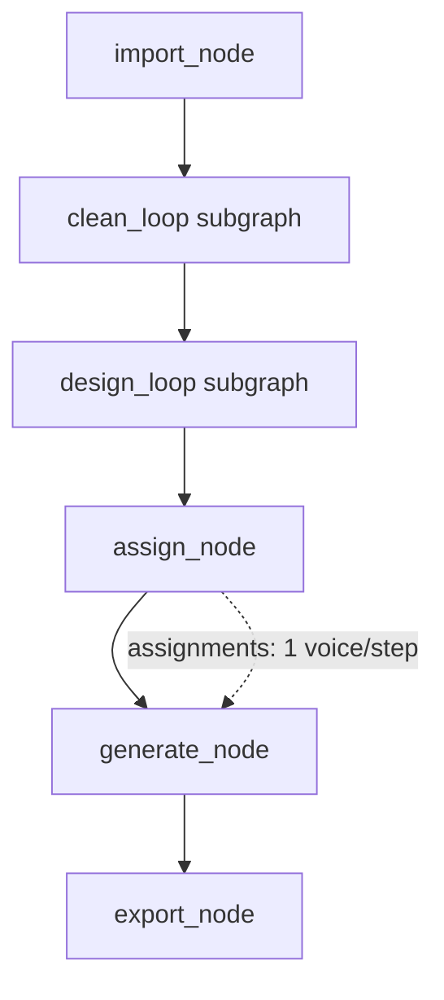
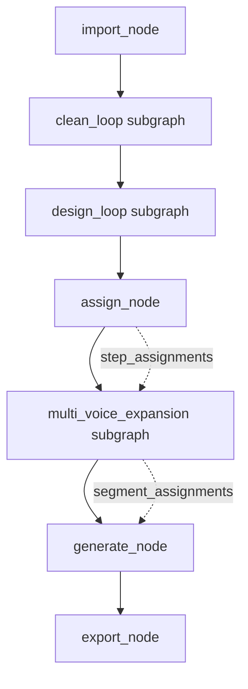

# Architecture LangGraph — omnistudio vs voxstudio

Décision architecturale sur l'intégration du multi-voix par étape dans le graphe LangGraph hérité de voxstudio. Référence : PRD-MIGRATION-001 v1.5 (décision 8, annexes E + M), point Codex #4.

---

## Décision : Option B — extension du graphe

Deux options ont été évaluées avant le démarrage de Phase 3 :

| Option | Description | Effort | Risque |
|--------|-------------|--------|--------|
| **A. Refactor** | Réécrire `workflow.py` + nodes pour supporter multi-voix natif dès la racine du State | ~4-5 h | Élevé (5 nodes à toucher, state schema cassé) |
| **B. Extension** | Garder le graphe voxstudio intact, ajouter un sous-graphe `multi_voice_expansion` appelé depuis `assign_node` | ~1-2 h | Faible (1 nouveau subgraph, 1 node modifié) |

**Option B retenue** : moins invasive, réutilise 80 % du code LangGraph voxstudio, isole la complexité multi-voix dans un seul module.

---

## Schéma avant / après

### Graphe voxstudio (1 voix par étape, hérité)



State : `assignments: Dict[step_id, VoiceAssignment]`

### Graphe omnistudio (N voix/étape via tags)



Un seul node modifié (`assign_node`) + un nouveau sous-graphe (`multi_voice_expansion`). Les autres nodes restent inchangés.

State enrichi : `segment_assignments: List[SegmentAssignment]` en plus de `assignments`.

---

## Schéma State enrichi

```python
from typing import List, Optional, TypedDict
from typing_extensions import Annotated
from langgraph.graph import add

class SegmentAssignment(TypedDict):
    segment_id: str              # ex. "step_001_seg_02"
    step_id: str                 # parent step
    text: str                    # fragment de texte (sans tags)
    voice: str                   # nom de la voix (système ou user)
    language: str                # code ISO ou "auto"
    speed: float                 # multiplicateur 0.5-2.0
    instruct: Optional[str]      # instruction émotionnelle optionnelle
    duration: Optional[float]    # durée fixe optionnelle

class StepAssignment(TypedDict):
    step_id: str
    default_voice: str           # voix par défaut de l'étape (fallback)
    segments: List[SegmentAssignment]  # 1 à N segments

class WorkflowState(TypedDict):
    # ... champs hérités de voxstudio ...
    assignments: Dict[str, VoiceAssignment]          # hérité : 1 voix/step (legacy fallback)
    step_assignments: List[StepAssignment]           # NOUVEAU : groupement par step
    segment_assignments: Annotated[List[SegmentAssignment], add]  # NOUVEAU : liste plate, append-only
```

Le reducer `Annotated[List, add]` sur `segment_assignments` permet l'ajout incrémental par `multi_voice_expansion` sans casser les patterns LangGraph existants.

---

## Parser multi-voix (tag explicite uniquement)

Le parser lit les tags `[voice:X]` dans le texte de chaque étape et produit une liste de segments. **Auto-segmentation dialogue reportée à PRD-EVOLUTION-003** (décision 8 PRD v1.5).

### Regex de validation du nom

```python
^[a-zA-Z][a-zA-Z0-9_-]{2,49}$
```

- Commence par une lettre
- 3 à 50 caractères
- Alphanumériques + `_` et `-` uniquement
- **Sécurité XSS** : rejette `<`, `>`, `'`, `"`, espaces, entités HTML (voir PRD annexe M)

### Comportement

| Entrée | Résultat |
|--------|----------|
| Tag valide (ex. `[voice:Marianne]`) | Segment attribué à Marianne |
| Tag malformé (ex. `[voice:Jean<script>]`) | Texte littéral, log warning |
| Voix inexistante (regex OK mais pas dans `/voices`) | 422 côté `/api/assign` avec liste des voix disponibles |
| Aucun tag | 1 segment avec voix par défaut de l'étape |

### Implémentation (référence)

```python
import re
from typing import List

TAG_RE = re.compile(r'\[voice:([a-zA-Z][a-zA-Z0-9_-]{2,49})\]')

def parse_segments(step_text: str, default_voice: str, step_id: str) -> List[SegmentAssignment]:
    """Parse [voice:X] tags et découpe en segments.

    - Texte avant le 1er tag : voix par défaut
    - Texte entre [voice:A] et le prochain tag : voix A
    - Dernier segment : voix du dernier tag
    """
    parts = TAG_RE.split(step_text)
    segments = []
    current_voice = default_voice
    idx = 0

    for i, part in enumerate(parts):
        if i == 0:
            # Texte avant le 1er tag
            if part.strip():
                segments.append({
                    "segment_id": f"{step_id}_seg_{idx:03d}",
                    "step_id": step_id,
                    "text": part.strip(),
                    "voice": current_voice,
                    "language": "fr",
                    "speed": 1.0,
                    "instruct": None,
                    "duration": None,
                })
                idx += 1
        elif i % 2 == 1:
            # Nom de voix (groupe capturé par le regex)
            current_voice = part
        else:
            # Texte après un tag
            if part.strip():
                segments.append({
                    "segment_id": f"{step_id}_seg_{idx:03d}",
                    "step_id": step_id,
                    "text": part.strip(),
                    "voice": current_voice,
                    "language": "fr",
                    "speed": 1.0,
                    "instruct": None,
                    "duration": None,
                })
                idx += 1

    return segments
```

### Exemple

```python
text = "Hello world. [voice:Jean] Hi there. [voice:Marianne] Back to you."
default = "Marianne"

parse_segments(text, default, "step_001")
# →
# [
#   {"segment_id": "step_001_seg_000", "text": "Hello world.", "voice": "Marianne", ...},
#   {"segment_id": "step_001_seg_001", "text": "Hi there.",    "voice": "Jean", ...},
#   {"segment_id": "step_001_seg_002", "text": "Back to you.", "voice": "Marianne", ...},
# ]
```

### Matrice des 20 cas limites

Voir PRD annexe M (testée dans `test_tag_explicite.py`). Liste condensée :

- Multilignes (`\n` avant/après tag)
- Tag orphelin en fin de texte
- Tags consécutifs (`[voice:A][voice:B]` → B gagne)
- Nom trop court (< 3 chars) ou trop long (> 50)
- Injection XSS (`<script>`, `'`, `&lt;`)
- Voix inexistante
- Tag en majuscule (`[VOICE:Jean]`) → pas reconnu (syntaxe stricte)

---

## Sous-graphe `multi_voice_expansion`

Appelé par `assign_node` après avoir attribué une voix par défaut à chaque étape.

### Pseudocode

```python
def multi_voice_expansion_node(state: WorkflowState) -> WorkflowState:
    """Expanse chaque étape en N segments via le parser [voice:X].

    Produit segment_assignments (List plate) pour generate_node.
    """
    segments = []
    step_assignments = []

    for step_id, step in state["steps"].items():
        default_voice = state["assignments"][step_id]["voice"]
        step_segments = parse_segments(step["text"], default_voice, step_id)

        # Vérification ownership : chaque voix référencée doit être accessible
        for seg in step_segments:
            if not check_voice_ownership(seg["voice"], state["user_sub"]):
                raise HTTPException(422, f"Voix '{seg['voice']}' inaccessible")

        step_assignments.append({
            "step_id": step_id,
            "default_voice": default_voice,
            "segments": step_segments,
        })
        segments.extend(step_segments)

    return {
        "step_assignments": step_assignments,
        "segment_assignments": segments,  # grâce au reducer `add`, les segments s'accumulent
    }
```

---

## Adaptation `generate_node`

Le node de génération batch groupe désormais par `(voice, language, speed)` **inter-étapes ET inter-segments** pour optimiser les appels batch à OmniVoice.

### Avant (voxstudio)

```python
# Grouper par (voice, lang, speed) en itérant sur les étapes
grouped = group_by(state["assignments"], key=lambda a: (a.voice, a.lang, a.speed))
for (voice, lang, speed), steps in grouped.items():
    texts = [state["steps"][s]["text"] for s in steps]
    audio_paths = tts_client.batch_preset(texts, voice, lang, speed)
```

### Après (omnistudio)

```python
# Grouper par (voice, lang, speed) en itérant sur les segments (pas les étapes)
grouped = group_by(state["segment_assignments"], key=lambda s: (s.voice, s.language, s.speed))
for (voice, lang, speed), segments in grouped.items():
    texts = [s["text"] for s in segments]
    audio_paths = tts_client.batch_preset(texts, voice, lang, speed)
    # Ré-assigner chaque audio à son segment (segment_id)
    for seg, path in zip(segments, audio_paths):
        state["segment_audio"][seg["segment_id"]] = path

# Puis concaténer les segments par étape en suivant l'ordre segment_id
for step_id, step in state["step_assignments"].items():
    step_audio = concatenate([state["segment_audio"][s["segment_id"]] for s in step["segments"]])
    state["step_audio"][step_id] = step_audio
```

---

## Adaptation `assign_node`

Le filtre sur les voix natives (`filter: assignments.instruct only for native voices`) est **retiré** car OmniVoice n'a pas de voix natives. Toutes les voix (système + user) acceptent `instruct`.

---

## Critères de validation (Phase 2 tests rouges)

Les tests suivants doivent être rouges avant Phase 3 :

- `test_multi_voix.py::test_parser_tag_simple` — 1 segment, voix par défaut
- `test_multi_voix.py::test_parser_3_segments` — texte avec 2 tags = 3 segments
- `test_multi_voix.py::test_parser_xss` — injection `[voice:Jean<script>]` → texte littéral
- `test_multi_voix.py::test_parser_voix_inexistante` — 422 avec liste
- `test_multi_voix.py::test_generate_node_groupe_inter_segments` — optimisation batch
- `test_multi_voix.py::test_ownership_segment` — refus 403 si segment référence voix de Bob par Alex
- `test_tag_explicite.py` — 20 cas limites de l'annexe M

---

## Patterns LangGraph appliqués

Bonnes pratiques LangGraph respectées par cette extension (cf. `~/.claude/skills/_rares/langgraph/SKILL.md`) :

- **Reducer `add` append-only** sur `segment_assignments` : les segments s'accumulent sans écraser l'état existant, pattern identique au `messages: Annotated[list, add_messages]` canonique.
- **Nodes stateful** : `multi_voice_expansion` lit `state["steps"]` et `state["assignments"]`, écrit uniquement `step_assignments` + `segment_assignments`. Pas de monkey-patching du State.
- **Pas de giant monolithic state** : les nouveaux champs sont cohérents et nommés (`step_assignments` / `segment_assignments`), pas un giant blob.
- **Conditional edges anti-infinite-loop** : hérité des subgraphs `clean_loop` et `design_loop` voxstudio (maximum 3 itérations, `interrupt_before="human_review"`). Aucun nouveau cycle introduit par `multi_voice_expansion` (1 passe, pas de boucle).
- **Checkpointer SqliteSaver** : hérité voxstudio (WAL mode + busy_timeout 5000ms). L'ajout de `segment_assignments` étend la taille du checkpoint (~2-3x), surveillé par le monitoring.

## Anti-patterns à éviter (propres à omnistudio)

- **Ne JAMAIS faire d'appels TTS dans `multi_voice_expansion`** : ce node parse et groupe uniquement, la génération est dans `generate_node` derrière le semaphore GPU.
- **Ne JAMAIS bypasser le parser** pour des raisons de perf : si un utilisateur insère un tag malformé, le regex de validation le rejette. Pas de shortcut qui contournerait la vérification XSS.
- **Ne JAMAIS stocker le texte brut avec tags non parsés dans `segment_assignments`** : chaque segment doit contenir le texte **après** parsing (sans les `[voice:X]`), sinon OmniVoice prononce littéralement « voice X ».

## Références

- PRD v1.5 décision 8 + annexes E (schéma State) + M (matrice 20 cas limites)
- PRD-EVOLUTION-003 (à venir) : auto-segmentation dialogue via heuristiques NLP
- Skill langgraph : `~/.claude/skills/_rares/langgraph/SKILL.md` (patterns production)
- Code cible : `omnistudio/graph/subgraphs/multi_voice_expansion.py`, `omnistudio/graph/nodes/assign_node.py`, `omnistudio/graph/nodes/generate_node.py`
- Tests cible : `tests/test_multi_voix.py`, `tests/test_tag_explicite.py`
